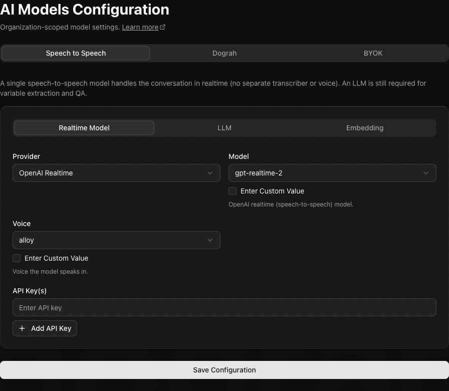
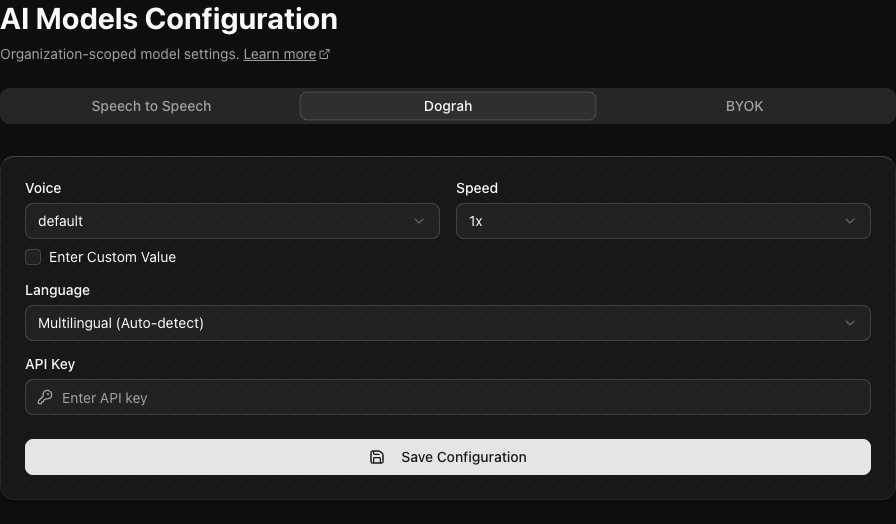
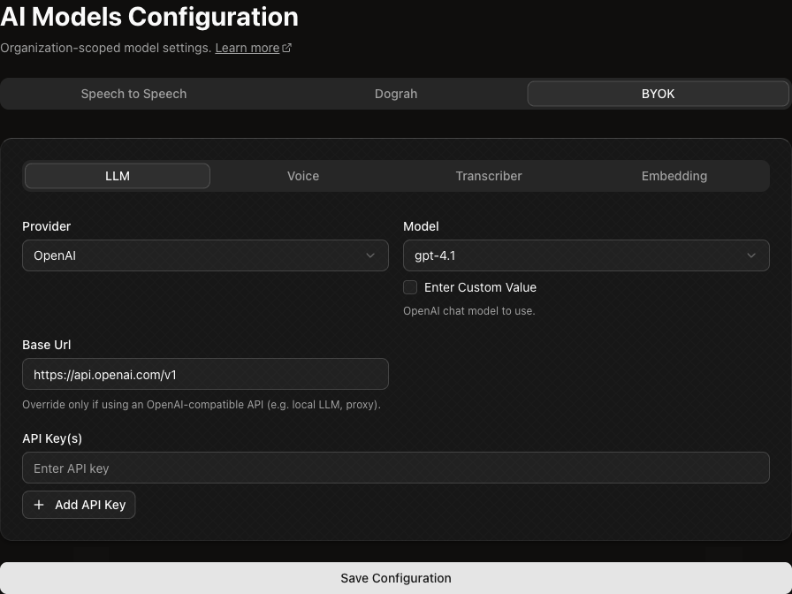

## How model configurations work

Model Configurations define the default AI model setup for your organization. Agents use this configuration unless you set agent-level model overrides in the agent settings.

To configure models, open **Models** in your Dograh dashboard:

- **Hosted:** `https://app.dograh.com/model-configurations`
- **Self-hosted:** `http://localhost:3010/model-configurations`
- **Local development:** `http://localhost:3000/model-configurations`

The Models page has three top-level sections:

| Section | When to use it |
|---------|----------------|
| **Speech to Speech** | Use a realtime speech-to-speech model for the live conversation. You still configure an LLM alongside it for variable extraction and QA. |
| **Dograh** | Use Dograh-managed LLM, voice, and transcriber models behind one Dograh Service Key. |
| **BYOK** | Bring your own provider keys and configure LLM, Voice, Transcriber, and Embedding models separately. |

<Note>
Model settings are organization-scoped. If no agent-level override is set, every agent in the organization uses the saved global configuration.
</Note>

## Speech to Speech

Use **Speech to Speech** when you want a realtime model to handle the live spoken conversation directly. In this mode, the realtime model handles speech input and speech output, so you do not configure separate Voice and Transcriber services.

The Speech to Speech section has nested tabs:

| Tab | What to configure |
|-----|-------------------|
| **Realtime Model** | The speech-to-speech provider, model, voice, and API key. |
| **LLM** | A standard LLM used for non-realtime tasks such as variable extraction and QA analysis. |
| **Embedding** | An embedding model used by features that need embeddings, such as retrieval from knowledge base content. |

<Warning>
An LLM is still required when you use Speech to Speech. The realtime model handles the live voice conversation, but Dograh uses the LLM for analysis tasks that happen outside the live audio stream.
</Warning>

## Dograh

Use **Dograh** when you want Dograh to manage the model providers for you. This path uses one Dograh Service Key for Dograh-managed models instead of separate provider keys for LLM, Voice, and Transcriber.

Configure:

| Field | What it controls |
|-------|------------------|
| **Voice** | The Dograh-managed voice to use. |
| **Speed** | The voice playback speed. |
| **Language** | The language behavior, including multilingual auto-detect when available. |
| **API Key** | Your Dograh Service Key. Create Service Keys from **Developers**. |

For details on creating and using Service Keys, see [API Keys and Service Keys](api-keys#service-keys).

## BYOK

Use **BYOK** when you want to bring your own provider accounts and API keys. This gives you separate control over each model category.

<Warning>
When you use BYOK or external model providers, Dograh sends only the data required for the selected service to operate. Depending on the provider and service type, this may include prompts, conversation history, transcripts, audio, generated text, tool/function definitions, tool inputs or results, and request metadata.

Provider data handling varies. Review each provider's data processing, retention, model training, and regional hosting policies before using sensitive data.
</Warning>

The BYOK section has nested tabs:

| Tab | What to configure |
|-----|-------------------|
| **LLM** | The chat or reasoning model provider, model, optional base URL, and API key. |
| **Voice** | The text-to-speech provider, voice, model, speed, optional base URL, and API key. |
| **Transcriber** | The speech-to-text provider, model, language, and API key. |
| **Embedding** | The embedding provider, model, and API key. |

Provider-specific fields appear only when they apply. For example, OpenAI-compatible LLM providers can expose a **Base URL** field, ElevenLabs voices can expose a voice ID, and transcribers can expose language options.

## Agent-level model overrides

You can override the organization model configuration for an individual agent. This is useful when different agents need different models, voices, transcribers, or providers.

To configure an override:

1. Open the agent.
2. Go to **Settings**.
3. Open **Model Overrides**.
4. Enable the override for the service you want to customize.
5. Configure the provider, model, and keys for that service.
6. Save the agent settings.

Agent-level overrides are selective. For example, you can override only the Voice service for one agent while it continues to use the organization-level LLM and Transcriber configuration.
