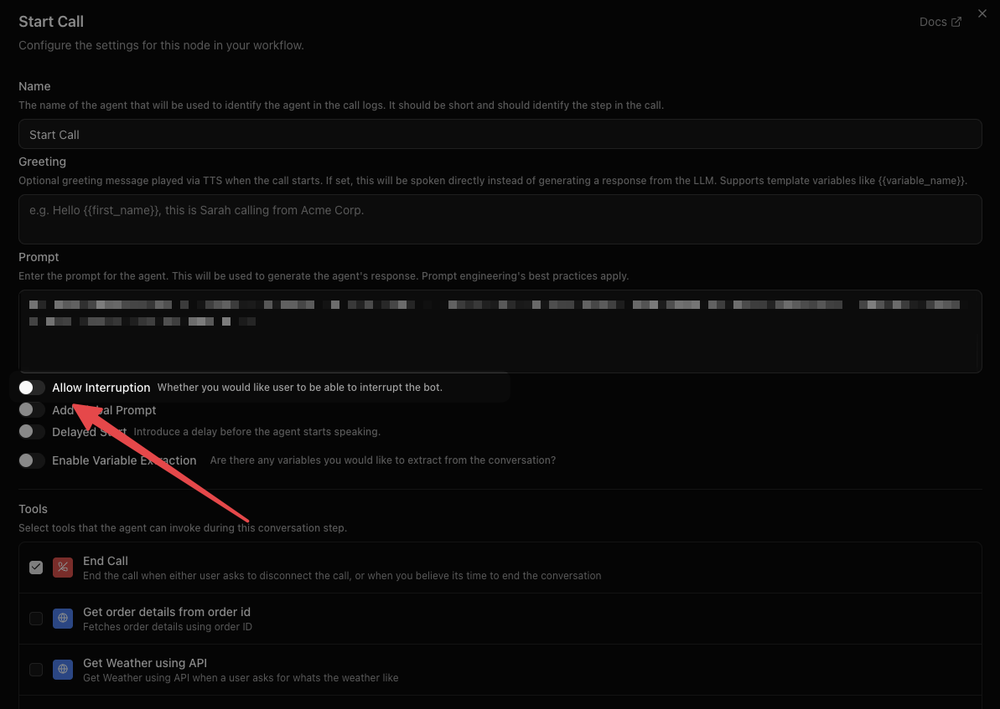

## Overview

Interruption handling controls whether the user can "barge in" and interrupt the bot while it is speaking. This is configured **per node** in the workflow editor, giving you fine-grained control over conversation flow.

## What is VAD?

VAD (Voice Activity Detection) is what makes barge-in possible — it's the model that listens to the incoming audio stream and decides whether the caller is currently speaking. Dograh's pipeline runs [Silero VAD](https://github.com/snakers4/silero-vad) by default to detect the start and end of user speech in real time. Some realtime providers (such as OpenAI Realtime, Azure Realtime, and Grok Voice Agent) supply their own VAD signals, so local Silero VAD is skipped for those calls.

When **Allow Interruption** is enabled on a node, VAD is what triggers the interrupt: the moment it detects the caller has started talking, the bot's speech is cut off and the pipeline starts processing the new input. When interruption is disabled, VAD output for the user's mic is ignored until the bot finishes speaking.

VAD also feeds turn-taking more generally — it's part of how Dograh decides a caller has finished a turn and the agent should respond, independent of whether interruption is enabled.

<Note>
**Valid sample rates**: Dograh's pipeline runs VAD at either **8000 Hz** or **16000 Hz** — no other value is accepted. The overall pipeline sample rate is capped at 16 kHz to satisfy this. This only matters if you're integrating a [custom telephony provider](/integrations/telephony/custom#audio-format-considerations); telephony providers built into Dograh (Twilio, Vonage, Plivo, etc.) already negotiate a supported rate for you.
</Note>

## How It Works

Each node in your workflow has an **Allow Interruption** toggle:

- **Disabled (default)** — The bot finishes its entire response before accepting user input. The user's microphone is temporarily muted while the bot speaks.
- **Enabled** — The bot stops speaking as soon as the user starts talking, and immediately processes their input. This creates a natural, conversational experience.

<Note>
When interruption is disabled and the user tries to speak during bot speech, a one-time warning appears in the live transcript indicating that interruption is disabled for that step.
</Note>

## When to Disable Interruption

Disabling interruption is useful when the bot needs to deliver a complete message without being cut off:

- **Legal disclaimers** — Ensure the full disclaimer is spoken before proceeding.
- **Critical instructions** — Step-by-step directions that lose meaning if partially heard.
- **Greeting or introduction** — Let the bot finish its opening before the user responds.
- **Confirmation summaries** — Read back important details (appointment times, order totals) in full.

## When to Enable Interruption

Keep interruption enabled for interactive conversation stages:

- **Q&A or objection handling** — Let the user jump in naturally.
- **Open-ended discussion** — Feels more human when either party can interject.
- **Long responses** — Allow the user to redirect if the bot goes off track.

## Configuring Interruption

1. Open your workflow in the **Voice Agent Builder**.
2. Select the node you want to configure.
3. Toggle **Allow Interruption** on or off in the node settings panel.
4. Save your workflow.

You can set different interruption behavior for each node. For example, disable interruption on your Start Node greeting but enable it on all subsequent Agent Nodes.

## What the User Experiences

| Interruption | Bot Speaking | User Speaks | Result |
|---|---|---|---|
| Enabled | Yes | Yes | Bot stops, processes user input |
| Disabled | Yes | Yes | Bot continues, user input is ignored until bot finishes |
| Either | No | Yes | User input is processed normally |

When interruption is disabled, the platform mutes the user's audio input while the bot is speaking. Once the bot finishes, the microphone is automatically unmuted and the user can respond normally.