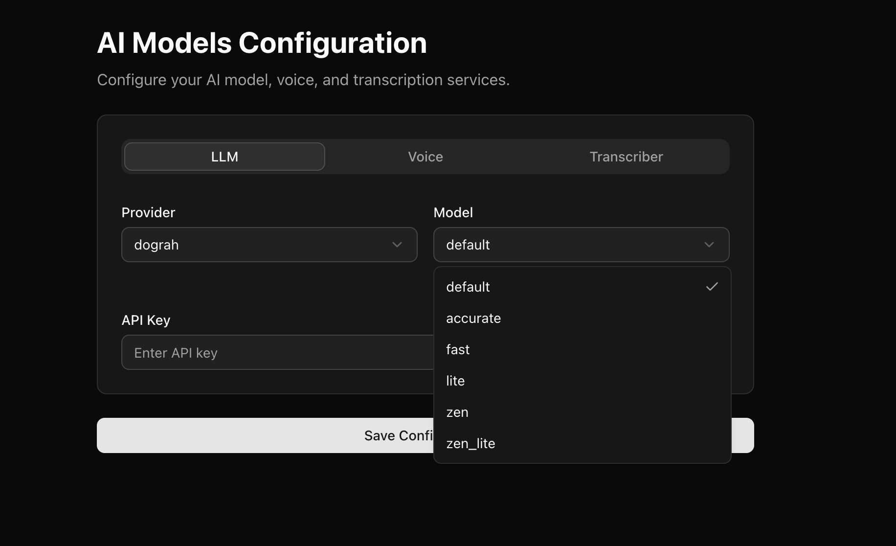
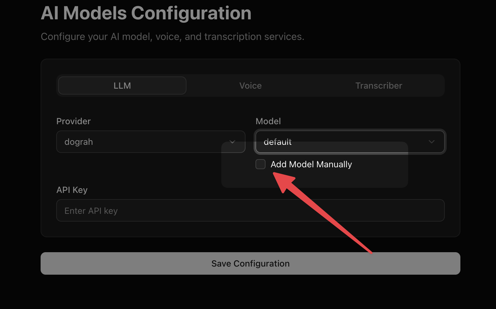

Dograh platform supports OpenAI, Google AI Studio, Google Vertex AI, Azure OpenAI, AWS Bedrock, Groq, OpenRouter, Hugging Face, MiniMax, Sarvam, and Dograh-managed LLMs. There are some models provided by default for you to choose from the drop down. 

<Warning>
LLM providers receive the data needed to generate responses, such as prompts, conversation history, model settings, and any configured tool/function definitions or tool call context. Review the provider's data processing, retention, model training, and regional hosting policies before using sensitive data.
</Warning>

For locally deployed or self-hosted LLMs, Dograh also supports OpenAI-compatible endpoints such as Ollama and vLLM.

If you don't find a model in the drop down, you can always add a model manually.

