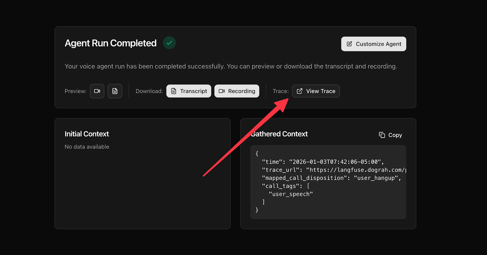
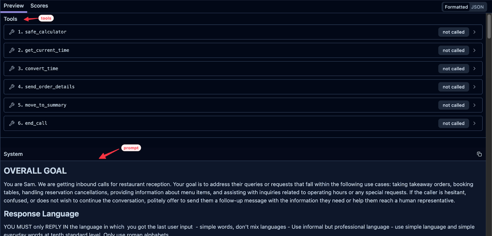
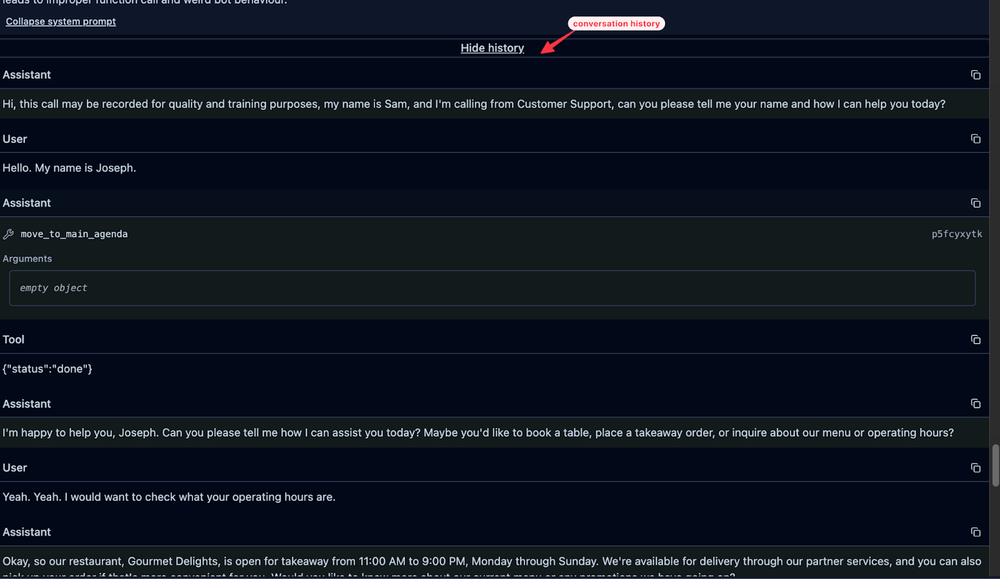

## Overview

Tracing gives you full visibility into what happened during a test call or live call. It's one of the most powerful features for making your voice agents production-ready.

With traces, you can see:

- The exact conversation that occurred
- What prompts were sent to the LLM
- Which tools the LLM had access to (and which it called)
- Speech-to-text transcriptions of user input and Transcription errors
- Tool call requests and responses

<iframe width="560" height="315" src="https://www.youtube.com/embed/Pnw4Yt155yw?si=ThcNQT_z5StNXzuF" title="YouTube video player" frameborder="0" allow="accelerometer; autoplay; clipboard-write; encrypted-media; gyroscope; picture-in-picture; web-share" referrerpolicy="strict-origin-when-cross-origin" allowfullscreen></iframe>

## Accessing Traces

After a call ends, you'll see a call summary screen. Click the **Traces** tab to view the detailed trace log for that call.



## Understanding Trace Sections

Traces are organized by event type. The two most important sections to focus on are:

### STT (Speech-to-Text)

These entries capture the transcription of what the user said during the call. Each STT entry shows the text conversion of the user's speech at that point in the conversation.

**Example:**

STT: "Yeah, I would want to check what your operating hours are."

### LLM (Language Model Calls)

These entries show every call made to the LLM. Each LLM trace includes:

- **Prompt** - The full prompt sent to the LLM (combination of global prompt + node-specific prompt)
- **Conversation history** - The entire conversation up to that point  
- **Available tools** - All tools the LLM can access for that node
- **Response** - What the LLM generated





## Tools in Traces

Each LLM call shows the tools available to the agent at that moment. These fall into three categories:

### System Tools (Default)

Every node includes these by default:

- **Safe Calculator** — Helps LLMs perform math accurately
- **Get Current Time** — Retrieves current time
- **Convert Time** — Converts time to a specific timezone

### Pathway Tools

These correspond to the pathways (node transitions) you've configured. For example, if your node has pathways to "End Call" and "Move to Summary," you'll see those as available tools.

The tool descriptions shown in traces match the descriptions you set in your pathway configuration.

### Custom Tools

Any external tools you've attached to the node (e.g. any custom tools you created for API endpoints for booking, order submission, etc.) will appear here. See the [custom tools documentation](/voice-agent/tools/http-api).

## Tool Calls in Traces

When the LLM decides to call a tool, you'll see:

1. **Tool call request** — The tool name and parameters sent
2. **Tool response** — The result returned (e.g., `{"status": "ok"}`)

The tool call and response also appear in subsequent conversation history, so the LLM knows the outcome.

**Example flow:**

**User:** "Can you book me a table for tomorrow at 7pm?"

**LLM calls:** book_table(date: "tomorrow", time: "7pm", party_size: 2)

**Tool response:** ```{"status": "done", "confirmation": "Table booked"}```

**Agent:** "I've booked your table for tomorrow at 7pm."

## How Prompts Are Combined

The prompt sent to the LLM is a combination of:

1. **Global Prompt** — Defined in your Global Node settings
2. **Node Prompt** — Defined in the specific node being executed

If you disable the Global Node for a particular node, only the node-specific prompt will be used.

## Key Concept: Conversation History

Every time an LLM call is made, the **entire conversation history up to that point** is passed to the LLM. This means:

- The LLM always has full context
- You can see exactly what context the LLM had when it made a decision
- Useful for debugging unexpected responses

## Setting Up Langfuse Tracing

[Langfuse](https://langfuse.com/docs) is an open-source LLM observability platform — it stores and visualizes traces (prompts, responses, tool calls) so you can debug and iterate on LLM-powered applications outside of Dograh's own trace viewer.

We provide seamless integration with Langfuse for tracing if you want to use your own account. This enables you to use the [playground feature of Langfuse](https://langfuse.com/docs/prompt-management/features/playground). This works on both managed and self-hosted Dograh deployments.

**Setup steps:**

1. Sign up at [Langfuse](https://langfuse.com) and create API credentials
2. In the Dograh UI, go to **Platform Settings** (`/settings`) and enter your Langfuse host, public key, and secret key
3. Click **Save**

Once enabled, traces will be available for every completed call in Dograh.

<Note>
For self-hosted deployments, you can also configure Langfuse via [environment variables](/developer/environment-variables#tracing-langfuse) (`LANGFUSE_SECRET_KEY`, `LANGFUSE_PUBLIC_KEY`, `LANGFUSE_HOST`) as a default for all organizations. Tracing activates automatically once credentials are available — no separate enable flag is required. Per-organization credentials set in the UI take precedence over environment variables.
</Note>

## Quick Reference

| Trace Type | What It Shows |
|------------|---------------|
| STT | User speech transcribed to text |
| LLM | Prompt + conversation + tools + response |
| Tool Call | Tool invocation and response |

## Tips for Using Traces

- **Debug unexpected responses** — Check the LLM trace to see what prompt and context the model received
- **Verify tool calls** — Confirm tools are being triggered with correct parameters
- **Refine prompts** — Use traces to see how your prompt instructions affect LLM behavior
- **Check transcription accuracy** — Review STT entries if the agent misunderstands users