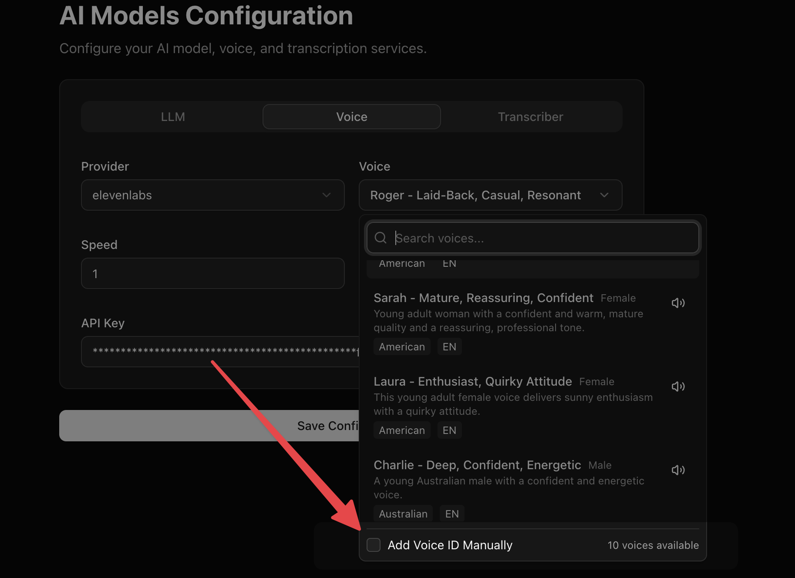

Dograh platform supports ElevenLabs, OpenAI, Google, Azure Speech, Deepgram, Cartesia, Smallest AI, MiniMax, Sarvam, Rime, Inworld, Camb.ai, xAI, and Dograh TTS engines. There are some voices from the providers that we ship by default. You can refer to the providers API documentation to select a voice ID that's most relevant for your language requirement.

<Warning>
Voice providers receive the data needed to synthesize speech, such as generated text, selected voice, model settings, and request metadata. Review the provider's data processing, retention, model training, and regional hosting policies before using sensitive data.
</Warning>

For locally deployed or self-hosted TTS models, Dograh also supports Speaches, an OpenAI API-compatible server for speech generation.

If you don't find your favourite voice, you can always add the voice ID manually.

