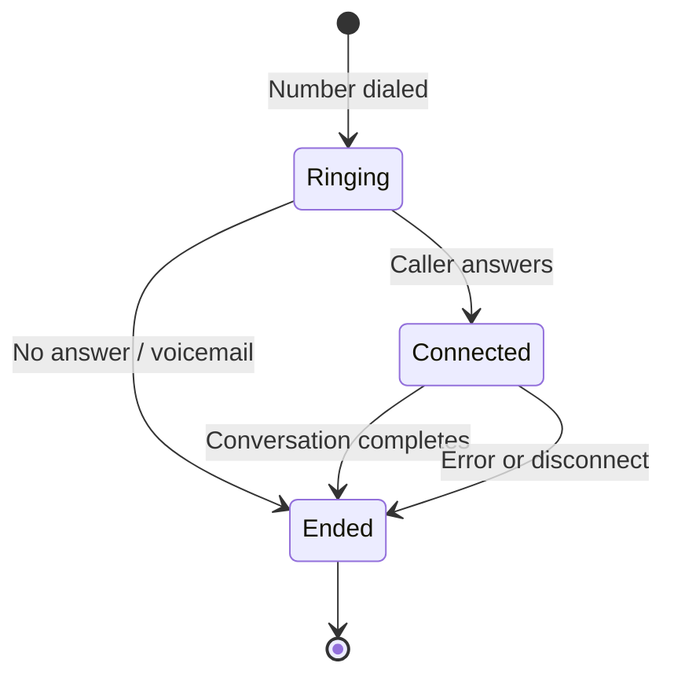

Every time a workflow executes, Dograh creates a **run**. The run is the record of that execution: what was said, what data was collected, how long it took, and what it cost.

## Calls vs runs

A **call** is the audio connection — whether over the phone via a telephony provider, or through the browser via Web Call.

A **run** is the Dograh record of the workflow execution. Every call — outbound, inbound, web, or campaign — creates a run with the same contents: transcript, recording, gathered context, usage, and cost. Campaign runs are additionally linked to their parent campaign.

## Call lifecycle

The call lifecycle tracks the telephony connection — from the moment a number is dialed to when the line drops.

For inbound calls, the flow starts when the caller dials in and the telephony provider routes the call to Dograh.

## Inbound vs outbound

**Outbound calls** are initiated by Dograh — you trigger them via the API or dashboard with a phone number and agent. Used for proactive outreach, reminders, and campaigns.

**Inbound calls** are initiated by the caller — your telephony provider routes incoming calls to a Dograh agent via a webhook URL. Used for support lines, hotlines, and IVR replacement.

## Web Calls

Web Call lets you talk to your agent directly from the browser — no phone number or telephony setup required. It runs the full pipeline: STT, LLM, TTS, recording, and transcript, exactly the same as a phone call.

Use it to try out your agent before going live. The run view shows the live transcript as the conversation progresses, node transitions as the workflow moves through the graph, and any tool or function calls the agent makes in real time.

## What a run contains

After a call completes, the run record includes:

| Field | Description |
|---|---|
| `status` | Final run state |
| `recording_url` | Download URL for the call audio |
| `transcript_url` | Download URL for the conversation transcript |
| `gathered_context` | Structured data extracted by the agent during the call |
| `initial_context` | The data passed in when the call was triggered |
| `usage_info` | Duration in seconds, token count |
| `cost_info` | Cost in USD |
