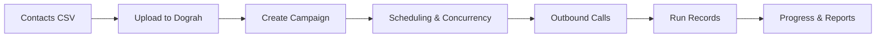

A campaign is how you run a workflow against many contacts automatically. Instead of triggering calls one by one via the API, you upload a list of phone numbers and Dograh dials them for you — respecting scheduling windows, concurrency limits, and retry rules.

## How a campaign works



1. **Upload a contacts CSV** — must have a `phone_number` column; any extra columns become `initial_context` for each call
2. **Create the campaign** — link it to a workflow, set concurrency, time slots, and retry behaviour
3. **Start it** — Dograh begins dialing contacts up to your concurrency limit
4. **Monitor progress** — track processed, completed, failed, and pending counts in real time
5. **Pause and resume** — stop and restart at any point without losing progress

## The contacts CSV

The CSV drives the campaign. Each row is one contact.

```csv
phone_number,customer_name,account_id,plan
+14155550100,Jane Smith,acc_001,premium
+14155550101,Bob Jones,acc_002,basic
```

Columns beyond `phone_number` are automatically passed as `initial_context` to each call, making them available as template variables in your agent's prompt — so each call can feel personalised at scale.

## Scheduling and concurrency

**Concurrency** controls how many calls run simultaneously. It's capped by your telephony plan. Set it conservatively to start.

**Time slots** restrict when Dograh is allowed to dial — useful for respecting business hours or regulations:

```json
{
  "timezone": "America/New_York",
  "time_slots": [
    { "day": "monday", "start": "09:00", "end": "17:00" },
    { "day": "tuesday", "start": "09:00", "end": "17:00" }
  ]
}
```

If no time slots are set, Dograh dials continuously once the campaign is started.

## Retry behaviour

Dograh can automatically retry contacts who didn't answer, were busy, or went to voicemail:

```json
{
  "retry_config": {
    "max_attempts": 3,
    "retry_interval_minutes": 60
  }
}
```

## Circuit breaker

The circuit breaker automatically pauses a campaign when the call failure rate gets too high — protecting against wasted spend and telephony reputation issues caused by a misconfigured agent or a bad contact list.

When enabled, Dograh monitors the failure rate within a rolling time window. If it exceeds the threshold, the campaign is paused automatically and must be manually resumed after the issue is investigated.

| Setting | Default | Description |
|---|---|---|
| Failure Threshold (%) | `50` | Pause when the failure rate within the window exceeds this percentage |
| Window (seconds) | `120` | Rolling time window over which the failure rate is calculated |
| Min Calls in Window | `5` | Minimum number of calls required before the circuit breaker can trip — prevents false positives on small samples |

A campaign paused by the circuit breaker behaves the same as a manually paused campaign — in-flight calls complete normally, and it can be resumed once the underlying issue is resolved.

## Campaign lifecycle

| Status | Meaning |
|---|---|
| `draft` | Created but not started |
| `running` | Actively dialing |
| `paused` | Stopped; resumes from where it left off |
| `completed` | All contacts processed |
| `failed` | Encountered a fatal error |

You can pause and resume a campaign at any time. In-flight calls complete normally before a pause takes effect.

## Results

Each contact's call creates a run record with the full transcript, recording, and gathered context — same as a manually triggered call. Use the [Get Campaign Runs](/api-reference/campaigns/runs) endpoint to retrieve them all.

See the [Campaigns API reference](/api-reference/campaigns) to get started.
