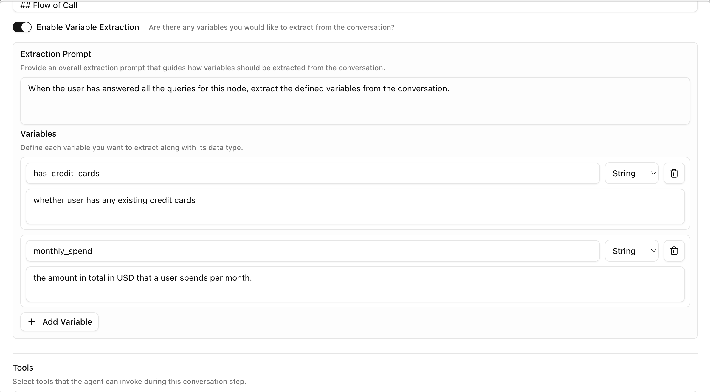
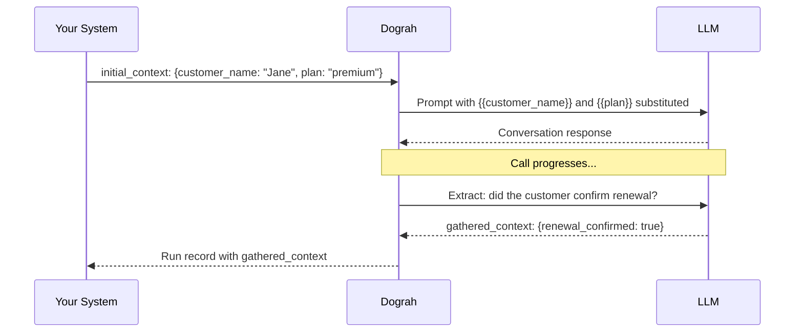

Dograh has a simple data model for passing information through a call. Understanding it is key to building agents that feel personalised and to extracting useful results after a call.

## The three context objects

```
initial_context ──► Agent ──► gathered_context
                       │
                 [template variables](/voice-agent/template-variables)
                 (used in prompts)
```

### initial_context

Data available to the agent before the call starts — the contact's name, account details, appointment information, anything the agent should know upfront. It can be set from several places:

- **[API trigger](/voice-agent/api-trigger)** — pass it in the request body when calling `POST /public/agent/{uuid}` or `POST /telephony/initiate-call`
- **[Campaign CSV](/core-concepts/campaigns)** — columns beyond `phone_number` automatically become `initial_context` fields for each contact's call
- **[Pre-call data fetch](/voice-agent/pre-call-data-fetch)** — enrich the context with data from your CRM or ERP via an HTTP call as the call starts, before the agent speaks
- **[Agent Settings](/voice-agent/template-variables#using-template-variables-for-testing)** — set template context variables on the agent for testing; they're included in test calls from the workflow editor and ignored on production calls

### Template variables

Values from `initial_context` are available in your agent's prompt using `{{double_brace}}` syntax.

```
You are calling {{customer_name}} about their {{plan}} plan,
which renews on {{renewal_date}}. Be friendly and confirm
whether they'd like to continue.
```

When the call starts, Dograh substitutes the values before sending the prompt to the LLM — so the agent speaks naturally as if it already knows the contact.

### Fallback values

If a variable might be missing or empty, use a pipe (`|`) to provide a default value:

```
Hello {{customer_name | there}}, we're calling about your {{plan | current}} plan.
```

When `customer_name` is not set, the agent will say "Hello there" instead of leaving a blank. The syntax is:

```
{{variable_name | fallback_value}}
```

If the variable is present and non-empty, the fallback is ignored and the actual value is used.

### Default variables

Built-in variables for current time and weekday, available in any prompt without setting up `initial_context`.

| Variable | Description | Example output |
|---|---|---|
| `{{current_time}}` | Current time in UTC (or inferred timezone) | `2026-04-02 14:30:45 UTC` |
| `{{current_time_<TIMEZONE>}}` | Current time in the specified timezone | `2026-04-02 20:00:45 IST` |
| `{{current_weekday}}` | Current weekday name in UTC (or inferred timezone) | `Thursday` |
| `{{current_weekday_<TIMEZONE>}}` | Current weekday name in the specified timezone | `Thursday` |

Replace `<TIMEZONE>` with an [IANA timezone name](https://en.wikipedia.org/wiki/List_of_tz_database_time_zones) such as `Asia/Kolkata`, `America/New_York`, or `Europe/London`.

```
Today is {{current_weekday}} and the current time is {{current_time_America/New_York}}.
```

<Note>
When you use a timezone suffix on **either** `current_time` or `current_weekday`, the other variable without a suffix will automatically use the same timezone instead of UTC. For example, if your prompt contains both `{{current_time_Asia/Kolkata}}` and `{{current_weekday}}`, the weekday will also be resolved in `Asia/Kolkata`.
</Note>

### Telephony variables

For telephony calls (inbound and outbound), Dograh automatically adds these variables to `initial_context`:

| Variable | Description | Example |
|---|---|---|
| `{{caller_number}}` | The phone number that initiated the call | `+14155550100` |
| `{{called_number}}` | The phone number that received the call | `+18005550199` |

For **inbound** calls, `caller_number` is the customer's number and `called_number` is your Dograh number. For **outbound** calls, it's the reverse — `caller_number` is your Dograh number and `called_number` is the customer's number.

```
You are speaking with the caller at {{caller_number}}.
```

### gathered_context

Data the agent extracts *during* the call — the opposite direction of `initial_context`. Use it to turn a conversation into structured data: what the customer wants, whether they confirmed something, a value they gave you out loud.

#### How it gets populated

Turn on **extraction** on an [Agent](/voice-agent/agent) or [End Call](/voice-agent/end-call) node and define one or more variables to extract. Each variable has:

| Field | Description |
|---|---|
| `name` | The key it will appear under in `gathered_context` |
| `type` | `string`, `number`, or `boolean` |
| `prompt` | A natural-language description of what to look for, e.g. *"Did the customer confirm the appointment?"* |



When the conversation reaches that node, the LLM reads the transcript so far and fills in each variable based on its `prompt`. If a value can't be determined from the conversation, the variable is left empty rather than guessed — leave the `prompt` specific enough that the LLM knows exactly what counts as a match.

You can add extraction to more than one node. Each node's extracted variables are merged into the same `gathered_context` object as the call progresses, keyed by `name` — reuse a `name` at a later node if you want to overwrite an earlier value.

#### How to reference it downstream

`gathered_context` is **not available in Agent prompts** — a prompt can only reference `initial_context` fields, because extraction typically happens after the conversation that would use it. To act on extracted data, send it out via a node instead:

| Where | Syntax | Notes |
|---|---|---|
| [Webhook node](/voice-agent/webhook) payload | `{{gathered_context.field_name}}` | Prefixed, since the payload template can also reference `initial_context` |
| [Run record](/developer/webhooks#payload-context-variables) (API / dashboard) | `gathered_context` object | Returned after the run completes, alongside `recording_url` and `transcript_url` |

```json
{
  "customer": "{{initial_context.customer_name}}",
  "resolution": "{{gathered_context.resolution}}",
  "callback_requested": "{{gathered_context.wants_callback}}"
}
```

See [Webhook Payloads](/developer/webhooks) for the full list of variables available alongside `gathered_context` in a payload template.

## Data flow example



## Where variables are available

| Location | Variables available |
|---|---|
| Agent node prompts | `initial_context` fields via `{{variable_name}}` |
| Edge conditions | Evaluated against the live conversation — no explicit variable syntax needed |
| Webhook payload templates | All context objects via `{{initial_context.field}}`, `{{gathered_context.field}}` etc. |
| Campaign CSV columns | CSV columns beyond `phone_number` become `initial_context` fields automatically |
