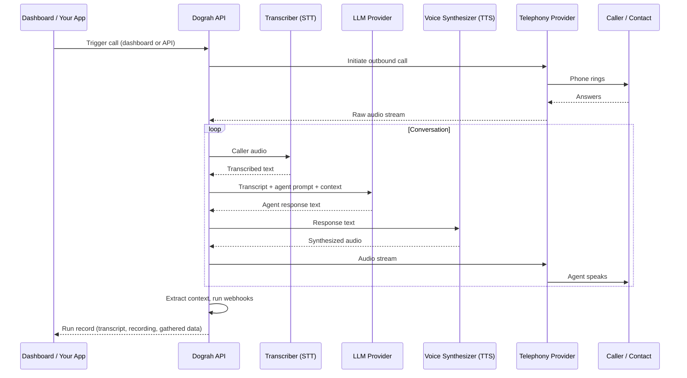

Dograh is a platform for building and running voice AI agents. You define a conversation flow, connect a phone number, and Dograh handles the rest — transcribing the caller's speech (STT), generating intelligent responses (LLM), speaking them back in a natural voice (TTS), and returning structured results when the call ends.

## The core loop

## Key components

**[Workflows (Agents)](/core-concepts/workflows-and-agents)**
The conversation logic. A workflow is a graph of nodes (conversation steps) connected by edges (conditional transitions). You define what the agent says, when it moves on, and what data it collects.

**[Runs](/core-concepts/calls-and-runs)**
Every execution of a workflow creates a run. The run record holds the transcript, recording, extracted data, and cost information.

**[Telephony](/integrations/telephony/overview)**
The phone infrastructure. Dograh connects to your telephony provider (Twilio, Vonage, etc.) to place and receive calls. The audio streams between the caller and Dograh in real time.

**[Transcriber (STT)](/configurations/transcriber)**
Converts the caller's speech to text in real time. Dograh sends the audio stream to your configured speech-to-text provider and uses the transcript to drive both the LLM and the final run record.

**[LLM Provider](/configurations/llm)**
Processes the transcript and the active node's prompt to generate the agent's next response. It also evaluates edge conditions to decide when to move the conversation forward.

**[Voice Synthesizer (TTS)](/configurations/voice)**
Converts the LLM's text response to audio and streams it back to the caller. The choice of TTS provider and voice is configurable per agent.

## How it fits together

When you trigger a call:

1. Dograh instructs your telephony provider to dial the number
2. When the caller answers, a real-time audio pipeline opens
3. The caller's speech is transcribed by the STT provider
4. The transcript is sent to the LLM with the active node's prompt and conversation history
5. The LLM responds — the response is synthesized to audio by the TTS provider and streamed to the caller
6. When an edge condition is met, Dograh transitions to the next node
7. When an end node is reached, the call ends
8. Post-call: context is extracted, webhooks fire, the run record is saved

## Next steps

<CardGroup cols={2}>
  <Card title="Workflows & Agents" href="/core-concepts/workflows-and-agents">
    How the conversation graph works
  </Card>
  <Card title="Calls & Runs" href="/core-concepts/calls-and-runs">
    The lifecycle of a call
  </Card>
  <Card title="Context & Variables" href="/core-concepts/context-and-variables">
    How data flows through a conversation
  </Card>
  <Card title="Campaigns" href="/core-concepts/campaigns">
    Running agents at scale
  </Card>
</CardGroup>
