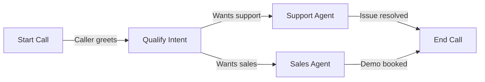
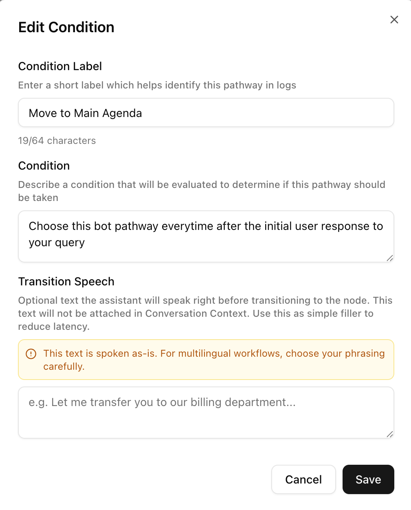

In Dograh, what you see as an **agent** in the dashboard is called a **workflow** in the API. They are the same thing — a workflow is the underlying definition, agent is the product name for it.

<Note>
Anywhere the API says `workflow`, think "agent". Anywhere the API says `workflow_definition`, think "the conversation logic inside your agent".
</Note>

## The graph model

A workflow is a **directed graph** — a set of nodes connected by edges.

**Nodes** are the steps in the conversation. Each node has a prompt that tells the LLM what to say and do at that point.

**Edges** are the transitions between nodes. Each edge has a condition — a natural language description of when to move on. The LLM evaluates whether the condition has been met based on the conversation so far.

## Node types

| Type | What it does |
|---|---|
| `startCall` | Entry point for telephony calls. The first thing the agent says when a call connects |
| `agentNode` | An LLM-powered conversation step. The core building block |
| `globalNode` | Defines instructions that apply across all agent nodes (e.g. tone, language, fallback behaviour) |
| `endCall` | Terminates the call |
| `trigger` | Entry point for API-triggered runs (non-telephony) |
| `webhook` | Fires an HTTP request when reached — use for CRM updates, notifications, etc. |
| `qa` | Runs automated quality analysis on the completed call |

## Edges and transitions

An edge connects two nodes and fires when its condition is satisfied:

`transition_speech` is optional — if set, the agent speaks it before moving to the next node.

## Versioning

Every time you update a workflow's `workflow_definition`, Dograh saves a new version while keeping the history. The current version is always what runs. Old versions are retained for auditing.

## Creating workflows

There are two ways to create a workflow via the API:

- **From a definition** — provide the full node/edge graph yourself. Best for programmatic generation.
- **From a template** — describe the use case in natural language and Dograh generates the initial graph using an LLM. Best for getting started quickly.

See the [Workflow Definition Schema](/developer/workflow-schema) for the full field reference.
