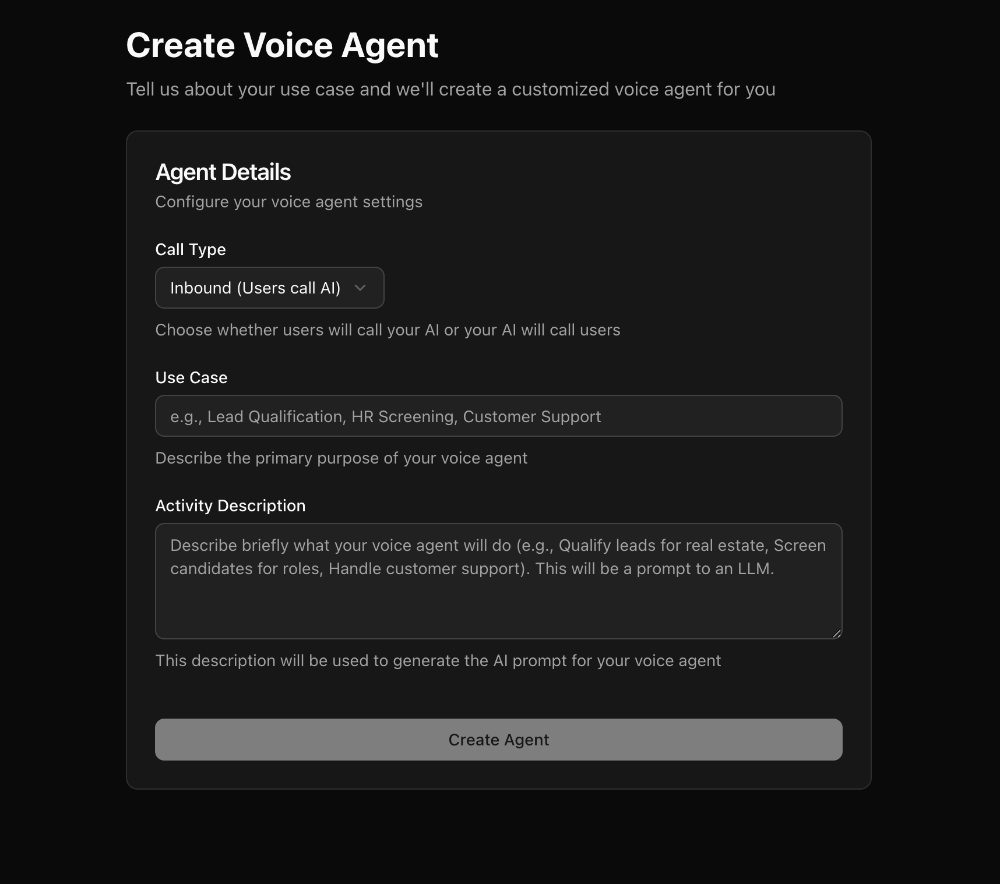

The Voice Agent Builder is a visual, graph-based editor for designing what your voice agent says and does during a call. Instead of writing one giant prompt, you break the conversation into **nodes** (stages of the conversation) connected by **pathways** (the routes the LLM can take between stages, based on how the conversation is going).

You can create a new agent from the [dashboard](https://app.dograh.com/workflow). Describe whether you need an "Inbound" or "Outbound" agent and your use case — this is sent to an LLM to generate a starting workflow with default prompts and pathways, which you can then edit.

## The graph model

A workflow is a directed graph:

- **Nodes** represent a stage of the conversation or an action (e.g. greet the caller, collect an address, transfer the call).
- **Pathways (edges)** connect nodes and represent the routes the LLM can take depending on what the caller says. The LLM decides at runtime which pathway to follow.

A workflow should have only one **Start Call** node and typically ends at an **End Call** node, with **Agent** nodes and other node types in between. See [Editing a Workflow](/voice-agent/editing-a-workflow) for how nodes, pathways, and node-level toggles fit together.

## Node types

| Node | What it does |
| --- | --- |
| [**Start Call**](/voice-agent/start-call) | Starts the call and configures the agent's greeting. Should have only one per workflow. |
| [**Agent**](/voice-agent/agent) | Holds the prompt that drives conversation at a given stage; connects to other nodes via pathways. |
| [**Global**](/voice-agent/global) | Common instructions (tone, objection handling) appended to every node with "Add Global Prompt" enabled. |
| [**QA**](/voice-agent/qa) | Runs automated post-call quality analysis against criteria you define. |
| [**API Trigger**](/voice-agent/api-trigger) | Exposes an endpoint so external systems (n8n, Zapier, your backend) can start outbound calls. |
| [**End Call**](/voice-agent/end-call) | Configures the agent's final message before the call is terminated. Should have only one per workflow. |
| [**Webhook**](/voice-agent/webhook) | Sends call results to an external system (CRM, Zapier, n8n) when a run ends. |

Beyond nodes, you can extend an agent with:

- [**Tools**](/voice-agent/tools/introduction) — let the LLM call external APIs, transfer calls, or invoke MCP servers mid-conversation.
- [**Knowledge Base**](/voice-agent/knowledge-base) — attach documents the agent can reference during a call.
- [**Pre-Call Data Fetch**](/voice-agent/pre-call-data-fetch) — enrich context with an HTTP call before the agent starts speaking.
- [**Pre-recorded Audio**](/voice-agent/pre-recorded-audio) — mix in real recordings alongside LLM-generated speech.
- [**Template Variables**](/voice-agent/template-variables) — reference `initial_context` and `gathered_context` values in prompts and payloads.

## Where to start

1. **New to Dograh?** Follow [Editing a Workflow](/voice-agent/editing-a-workflow) to learn the fundamentals of nodes and pathways.
2. **Want to test immediately?** Use a [Web Call](/core-concepts/calls-and-runs#web-calls) from the agent editor — no telephony setup required.
3. **Ready to go live?** Configure a [telephony provider](/integrations/telephony/overview) and add an [API Trigger](/voice-agent/api-trigger) or set up inbound routing.
4. **Need the call to hit your systems?** Add a [Webhook](/voice-agent/webhook) node to sync results to your CRM or automation tool.
5. **Want to embed the agent on a website?** See [Add to Website](/voice-agent/add-to-website).

## Related

- [Core Concepts: Workflows and Agents](/core-concepts/workflows-and-agents)
- [Core Concepts: Context & Variables](/core-concepts/context-and-variables)
- [Editing a Workflow](/voice-agent/editing-a-workflow)
