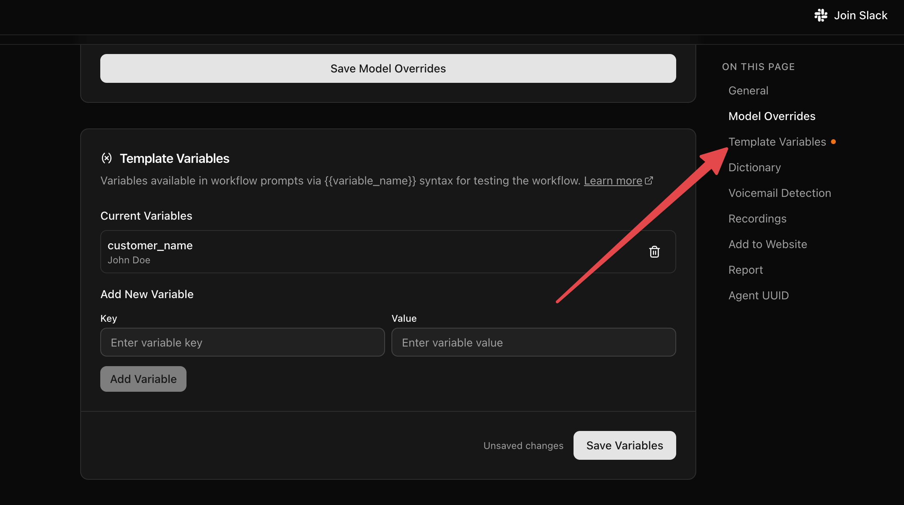

### Template Rendering

You reference template variables with `{{double_brace}}` syntax. The data comes from [`initial_context`](/core-concepts/context-and-variables#initial_context) — set via the [API Trigger](/voice-agent/api-trigger), a [campaign](/core-concepts/campaigns) sheet, or a [Pre-Call Data Fetch](/voice-agent/pre-call-data-fetch) that enriches the context when the call starts — and, in Webhook payloads only, from [`gathered_context`](/core-concepts/context-and-variables#gathered_context) (variables extracted during the call).

**The syntax depends on where you use it:**

| Where | `initial_context` | `gathered_context` |
| --- | --- | --- |
| Agent node prompts | `{{field_name}}` (referenced directly) | Not available |
| Webhook Node payloads | `{{initial_context.field_name}}` | `{{gathered_context.field_name}}` |

#### Agent node prompts

In an Agent node prompt, reference each `initial_context` field **directly by name**. Nested values are supported with dot notation.

Example: if the initial context is

```json
{
    "initial_context": {
        "user": {
            "name": "John"
        }
    }
}
```

write your prompt to access the user's name as below:

Prompt: `You are Alice, who is talking to {{user.name}}.`

<Note>
Variables extracted during the call (`gathered_context`) are **not** available in Agent prompts — a prompt can only reference `initial_context` fields. To act on extracted data, send it to a [Webhook Node](/voice-agent/webhook).
</Note>

#### Webhook Node payloads

When constructing a [Webhook Node](/voice-agent/webhook) payload, the context objects are nested under their names, so reference them with the `initial_context.` and `gathered_context.` prefixes:

Payload value: `{{initial_context.user.name}}` or `{{gathered_context.call_disposition}}`

### Using Template Variables for Testing

Template variables defined in your workflow **Settings > Context Variables** are included in test calls (both web and phone) made from the workflow editor. This is useful for simulating data that would normally come from telephony or an API trigger.



For example, you can set `caller_number` and `called_number` as context variables to test [Pre-Call Data Fetch](/voice-agent/pre-call-data-fetch#testing-with-test-calls) without needing a real inbound call.

<Note>
These context variables are only used during test calls from the workflow editor. On production inbound calls and campaign outbound calls, the actual telephony data is used and these values are ignored.
</Note>

### Nodes
Dograh Voice Agents are composed of various nodes. These nodes can provide instructions to the voice agent, help you setup a [trigger](/voice-agent/api-trigger) where you can trigger the voice agent to call someone, or help you setup a [webhook](/voice-agent/webhook), where you can update the results of the call in your CRM or trigger a downstream workflow in n8n. In the next steps, we will be documenting the nodes that you can use in building the voice agent.